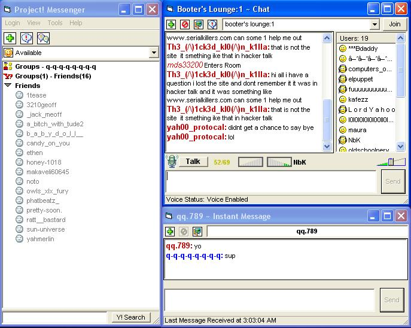



## Project\! Messenger NEW Version 2 \(Yahoo\! web msg/chat2 based chat client\)

### Description

This project is an update to my first 'Project! Messenger'. This new project include fixes, new chat room features, chat voice,filtering methods, more chat2 packets and more. With this example you can be on your way in creating your own full Yahoo! based chat client. Enjoy.
 
### More Info
 

             |
---                |---
**Submitted On**   |2004-06-16 03:00:42
**By**             |[Justin LeBlanc](https://github.com/Planet-Source-Code/PSCIndex/blob/master/ByAuthor/justin-leblanc.md)
**Level**          |Intermediate
**User Rating**    |4.9 (44 globes from 9 users)
**Compatibility**  |VB 6\.0
**Category**       |[Miscellaneous](https://github.com/Planet-Source-Code/PSCIndex/blob/master/ByCategory/miscellaneous__1-1.md)
**World**          |[Visual Basic](https://github.com/Planet-Source-Code/PSCIndex/blob/master/ByWorld/visual-basic.md)
**Archive File**   |[Project\!\_M1757816162004\.zip](https://github.com/Planet-Source-Code/justin-leblanc-project-messenger-new-version-2-yahoo-web-msg-chat2-based-chat-client__1-54409/archive/master.zip)

